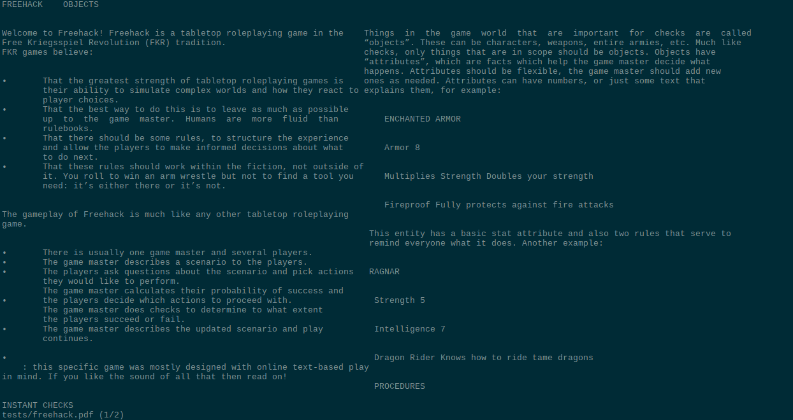

# npdfr

npdfr (ncurses PDF reader) is a command-line PDF reader prioritizing fast searches.




## Why?

I use a lot of PDFs for running tabletop RPGs and often need to search through them. This isn't nearly as snappy as it could be because of the tendency of PDF readers to lazy-render the PDF. I wanted a command-line reader that wouldn't do this and would respond to search queries more immediately.

## Platform Support

Really intended for use on Linux only, but should be reasonably easy to adapt to other operating systems.

## How to Build

Make sure the following dependencies are available:

- `python` 3.8+
- `pip`
- `virtualenv`
- `cmake`
- `make`
- `jsoncpp`
- `ncursesw`

Then run `./setup.sh` in the project root directory.

## How to Install

Run `./install.sh` in the project root directory. You must have `sudo` and `rsync` installed and you will be prompted for your password. You can pass an optional argument to install to set the installation prefix, e.g. `./install.sh /usr/local`. If you do not pass this argument it will default to `/usr`.

## Usage Instructions

If you have installed the program globally run:

```sh
npdfr /path/to/file.pdf
```

Otherwise run `./run.sh /path/to/file.pdf` in the project root directory. You can open multiple PDFs by supplying multiple file names.

## Keybindings

The keybindings are mostly the same as the `less` utility.

| Key                           | Action              |
|-------------------------------|---------------------|
| g, home                       | Go to first page    |
| G, end                        | Go to last page     |
| u, U                          | Go to start of page |
| d, D                          | Go to end of page   |
| tab                           | Next document       |
| shift+tab                     | Previous document   |
| space, f, F, page down        | Next page           |
| b, B, page up                 | Previous page       |
| h, H, left arrow              | Pan left            |
| e, E, j, J, enter, down arrow | Scroll down         |
| y, Y, k, K, up arrow          | Scroll up           |
| l, L, right                   | Pan right           |
| q, Q                          | Quit                |
| n                             | Find next           |
| N                             | Find previous       |
| /                             | Search forwards     |
| ?                             | Search backwards    |

## Credit & License

Developed by Amini Allight, licensed under the GPL 3.0.
